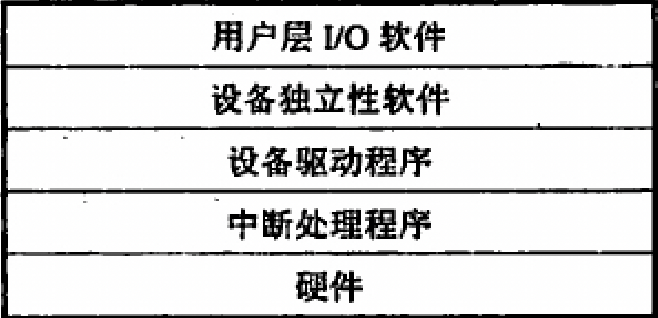

- {{embed [[IO设备]] }}
- IO的层次结构
	- {:height 244, :width 486}
- 设备控制器的组成
	- 与CPU的接口
	- 与设备的接口
	- IO控制逻辑
- IO管理需要完成的功能
	- 状态跟踪
	- 设备存取
	- 设备分配
	- 设备控制
- 一些注意点
	- 通常**中低速设备**挂接在**字节多路通道**上
	- 设备分配通常不需要考虑**及时性**
	- 每一类设备只需要**一个**驱动程序
	- 驱动程序负责**执行**操作系统提供的IO指令
- {{embed [[通道]] }}