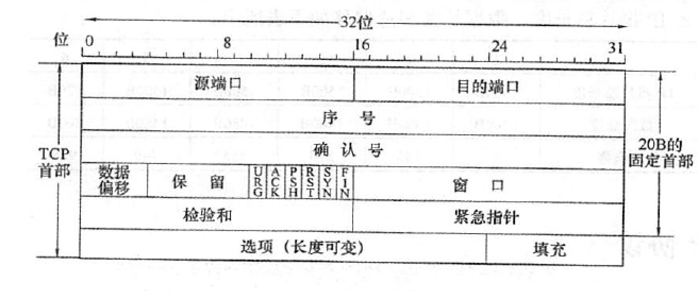

- 
- 序号：按照字节编制的偏移量
- 确认号：按照字节编制的确认号
- 数据偏移：指示首部长度，**以4B为单位**
- URG：标识数据为紧急，使能紧急指针，需要尽快交付
- ACK：ACK=1时确认号有效，根据要求**连接建立后ACK必须为1**
- PSH：指示无需充满缓存立即向上层提交数据
- RST：置1的时候立即释放连接，常用于出现严重错误
- SYN：指示这是一个连接请求或者连接接收的报文
- FIN：指示释放连接
- 窗口：指示**自身**剩余缓存大小
- 校验和：计算方式与UDP一致，唯一的区别是**将UDP的17更改为6**
- 紧急指针：指示紧急数字在报文段的长度
- 填充：使首部长度为4B的整数倍