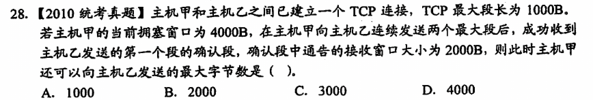
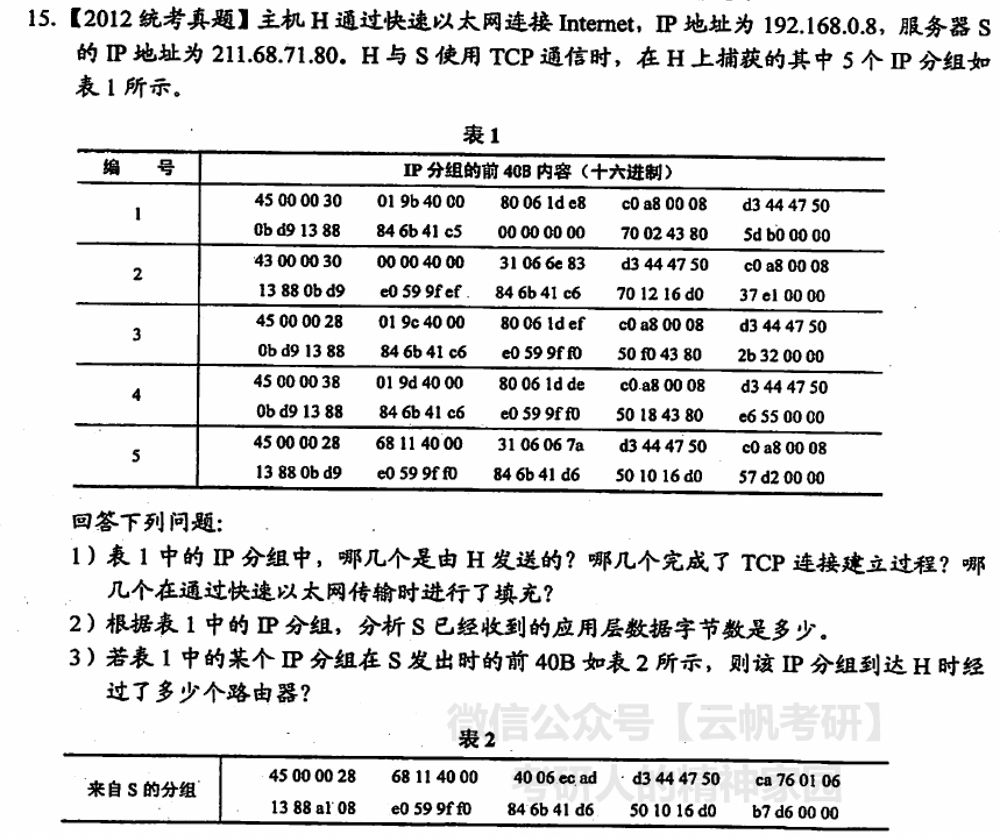
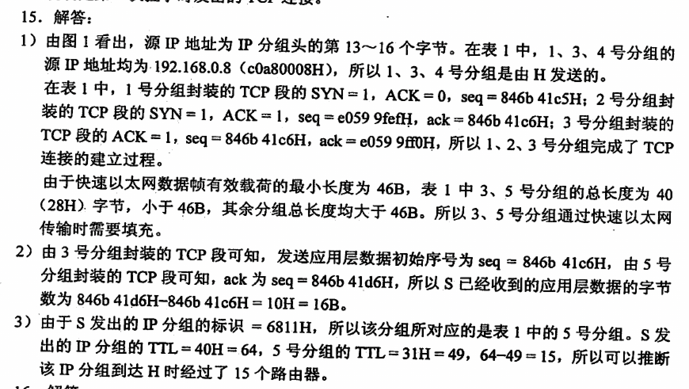
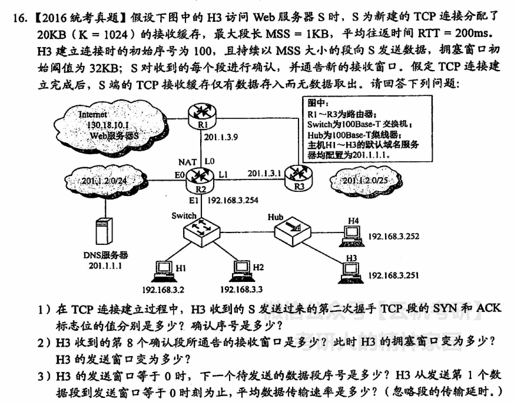
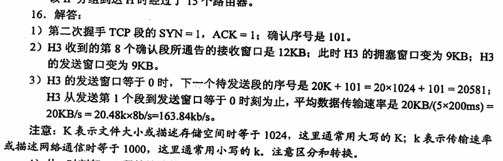

-  #card
  collapsed:: true
	- 答案：A
	  本题存在一个陷阱，即当确认第一个段之后，发送窗口为min[cwnd, rwnd] = 2000B，但是注意第二个段还未被确认，即实际上剩余的swnd = 1000B而非2000B
-  #card
  collapsed:: true
	- 本体存在一定的陷阱
	  (1)题中注意分组中的确认号，实际上第三个分组是对第二个分组的确认，即第三次握手的过程
	  (2)题根据S最后发出的确认号得知实际接收到的数据量，故参考第四个分组的确认号和第二个分组的确认号得到总共传送的数据量
	  (3)题中注意表2中的分组是在S端截取的，根据IP分组标识对应到第五个分组
	- 
-  #card
  collapsed:: true
	- 本题的关键在于第二题中注意是第八个**确认段**而非第八个RTT
	- 