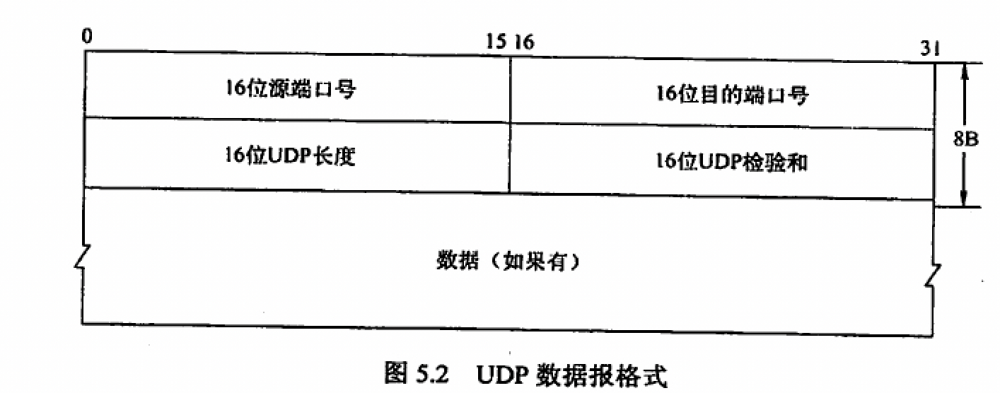

- 无连接且不可靠的协议
- 相对TCP的优点
  id:: 6114e60c-3be4-44ae-b446-0d74f16642a0
  + 不建立连接，不存在建立连接导致的延迟
  + 无连接状态，开销更小
  + 首部更小
  + 支持一对一、一对多、多对多
  + 没有拥塞控制，时间控制更自由
- 首部格式
   
  + 源端口号：不用时可以全部设置为0
  + 长度：**整个数据报**的长度，最小可以设置为8
  + 校验和：当计算校验不正确，直接丢弃，若不需要可以直接设置为0
- 校验方式
  1. 生成一个伪首部，伪首部包括源IP地址、目的IP地址、一个0字节、一个值为17的字节和两个字节表示的UDP长度。
  2. 将校验和先设置为全0
  3. 若UDP长度为奇数，在末尾补充一个0字节
  4. 将每16位作为一个单独的字串，并执行二进制加并对和取反得到校验码。
  5. 检验时若值为全1则未出错