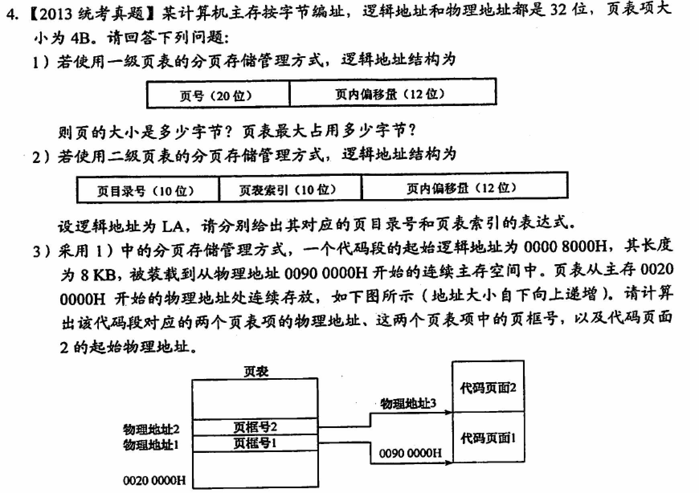

- 逻辑地址形成的阶段 {{cloze 链接}}
- 物理地址形成的阶段 {{cloze 装入}}
- 内存分配方式
	- 连续分配方式
		- 单一连续分配
		- 固定分区分配
		  id:: 612c8d0a-e61c-4440-9089-b97ef4f3bcbf
		- 动态分区分配
			- 首次适应
				- 按照地址排序，找到第一个可以适应的分区
			- 最佳适应
				- 按照大小排序，找到第一个可以适应的分区
			- 最坏适应
				- 直接使用最大的分区
			- 邻近适应
				- 按照首次适应开始，搜索位置从上一次搜索结束的位置开始
	- 非连续分配方式
		- [[基本分页存储]]
		- [[基本分段存储]]
		- [[段页式管理方式]]
- 