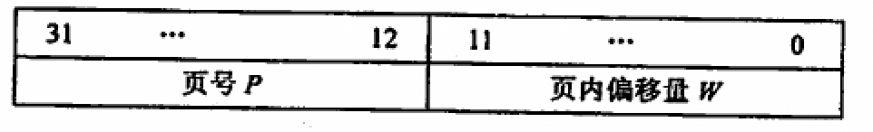

- 不会产生外碎片
- 以块为基本单位
- 块的大小相对于 ((612c8d0a-e61c-4440-9089-b97ef4f3bcbf)) 中的分区小很多
- 三个等价名称
	- 进程中的 页
	- 内存中的 页框
	- 磁盘中的 块
- 逻辑地址结构
	- 
	  id:: 612c94d5-0c26-40dd-b80e-4e46febb619f
- 地址转换结构
	- 硬件实现
- 快表（TLB）
	- 采用相联存储器实现
	- 部分实现可能在快表中查询到结果之后立即终止页表查询
- 两级页表
	- 通过一个高级的页表保存每个地址对应的下一级页表减小页表对内存的占用
	- 例如上面的地址，若使用单级页表，保存全部的页表项需要$2^{20}\times 4B$的空间
	- 由于两级页表第一级只允许占有一页，即$4KB$，故第一级可以索引$1K$个二级页表，而由于页内偏移量固定使用12位，即$4KB$，故二级页表中的页号共计10位
	- 1