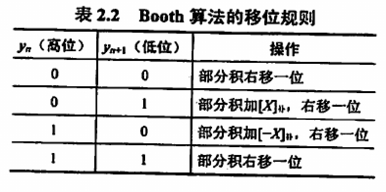

- 原码一位乘
	- 符号由两个操作数的符号位异或产生
	- 参与运算的为二者的绝对值
	- 绝对值携带**两位符号位**
	- 运算流程（假定计算n位数$x\times y$）
		- [[draws/2021-08-14-16-44-48.excalidraw]]
- 补码一位乘
	- Booth算法
	- 低位部分积注意是包含符号的
	- 总共进行$n + 1$次操作，但是最后一次操作不再进行位移
	- 积取双符号位
	- 扩展符号位$y_{n+1}$默认为0，后续通过移位进行更新
	- 移位操作遵循补码移位
	- {:height 348, :width 682}