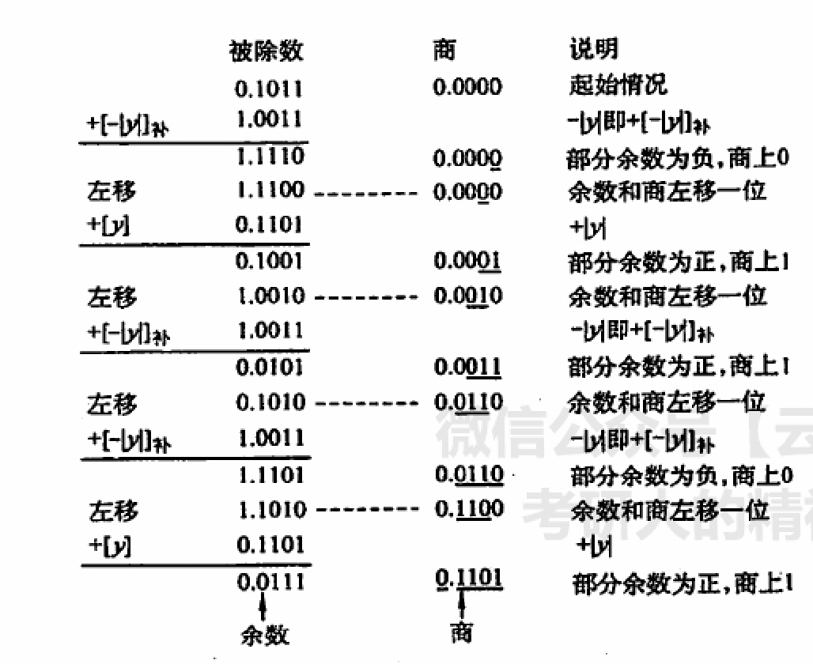
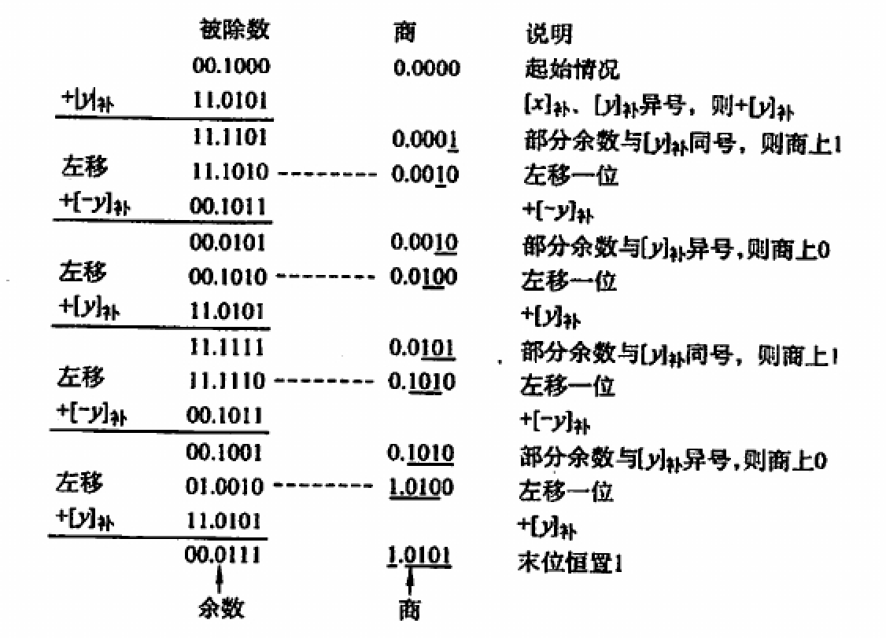

- $x/y$
- 原码除法
	- 绝对值参与运算
	- 符号异或得到
	- 初始化商和余数均为全0
	- 进行n + 1次操作
		- 判断
			- 余数为正，$+[-|y|]_补$，上商1
			- 余数为负，$+[|y|]_补$，上商0
		- 左移
		- 余数通过上一轮的余数（第一轮为被除数）按照上面的计算规则得到
	- ==注意如果最后一次余数与被除数**不同号**时应当对应加（减）一个 $[|y|]_补$ 得到正确结果==
	- 
- 补码除法
	- 使用**双符号位**，但是商依旧使用单符号位
	- 步骤：
		- 判断当前步被除数（部分余数）
			- 与除数同号，当前步上商1，商和部分余数左移一位，然后$+[-y]_补$
			- 与除数异号，当前步上商0，商和部分余数左移一位，然后$+[y]_补$
		- 上面的判断重复n + 1次，第一次（即被除数参与计算）不上商
	-
	  > 实际上步骤按照教材上可以展开为（下面的$x$代表$[x]_补$，$y$代表$[y]_补$）
	  > |x与y的符号|余数计算方式|余数与y的符号|操作|
	  > |-|-|-|-|
	  > |同号|$x - y$|同号（够减）|商1|
	  > |同号|$x - y$|异号（不够减）|商0|
	  > |异号|$x + y$|同号（不够减）|商1|
	  > |异号|$x + y$|异号（够减）|商0|
	- {:height 500, :width 682}
	-