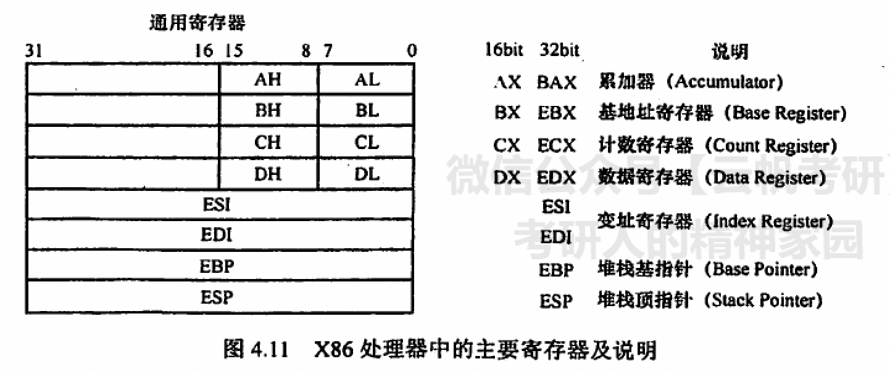
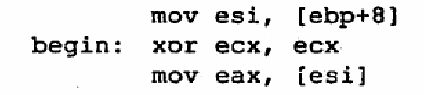

- 
- 地址计算
	- `[var]`指var这个地址对应的数据
	- 注意上面的`var`只能由最多两个寄存器和一个有符号常数计算得到
	- 正确计算语法
		- `[esi + eax]`
		- `[esi - 4]`
		- `[esi + eax - 4]`
	- 错误语法
		- `[esi - eax]`：寄存器不能相减
		- `[eax + esi + edi]`：寄存器数量不能超过三个
- 数据长度规定
	- 需显式声明
		- 一字节 DB
		- 二字节 DW
		- 四字节 DD
	- 或使用指示规则表舅
		- `byte ptr`
		- `word ptr`
		- `dword ptr`
- 常用命令
  > 约定
  > + `<reg>`指示任意寄存器，若后面带有数字则表示对应位数的寄存器
  > + `<mem>` 指示内存地址
  > + `<con>` 指示常数
	- 数据传送指令
		- `mov`：将第二个数的值复制到第一个数对应的地址
			- 常用语法
				- `mov <reg>,<reg>`
				- `mov <reg>,<mem>`
				- `mov <mem>,<con>`
				- `mov <reg>,<con>`
				- `mov <mem>,<reg>`
			-
			  > 注意不支持从`<mem>`到`<mem>`
		- `push`：入栈操作
			- `push <reg32>`
			- `push <mem>`
			- `push <con>`
		- `pop`：出栈操作，并将出栈元素送入对应地址中
			- `pop <reg32>`
			- `pop <mem>`
	- 算数/逻辑指令
		- `add/sub`：加/减，相加并保存到第一个操作数对应的地址中
			- `add/sub <reg> <reg>`
			- `add/sub <reg> <mem>`
			- `add/sub <mem> <reg>`
			- `add/sub <reg> <con>`
			- `add/sub <mem> <con>`
		- `inc/dec`：操作数自增/自减1
			- `inc/dec <reg>`
			- `inc/dec <mem>`
		- `not`：按位取反
			- `not <reg>`
			- `not <mem>`
		- `neg`：取负数
			- `neg <reg>`
			- `neg <mem>`
		- `shl/shr`：逻辑移位，将将第一个数移位第二个操作数位
			- `shl/shr <reg> <con8>`
			- `shl/shr <mem> <con8>`
			- `shl/shr <reg> <cl>`
			- `shl/shr <mem> <cl>`
	- 控制流指令
	  > 控制流指令使用`<label>`标记跳转的目的位置
	  > 常用语法方式 
		- `jmp`无条件跳转
			- `jmp <label>`
		- `jcondititon`系列，条件跳转指令
		   > 该指令根据处理器中的状态字进行条件跳转，状态字使用cmp指令进行设置
			- `je`，相等
			- `jne`，不等
			- `jz`，为0
			- `jg`，大于
			- `jge`，大于等于
			- `jl`，小于
			- `jle`，小于等于
		- `cmp`，比较指令
			- `cmp <reg> <reg>`
			- `cmp <reg> <mem>`
			- `cmp <mem> <reg>`
			- `cmp <reg> <con>`
		- `call/ret`负责子程序的跳转和返回