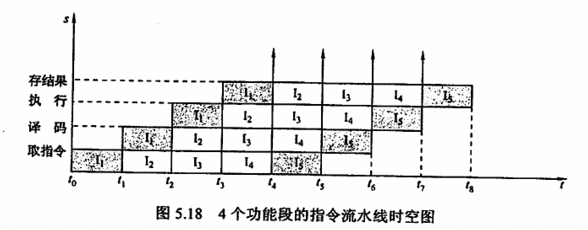

- 通常将执行过程分为
	- 四段流水
		- 取指
		- 译码
		- 执行
		- 写回
	- 五段流水
	  id:: 61249c0c-6c61-4d9e-8538-c5be369e1a55
		- 取指IF
		- 译码ID
		- 取操作数OF
		- 执行EX
		- 写回WB
- 流水段的长度以各个流水阶段中**最长**的决定
- 表示方式
	- 
- 分类
	- 部件功能级，处理机级和处理机间级
		- 部件功能级：将一个操作（如浮点数运算）切分为多个阶段进行流水
		- 处理机级：将一条指令的过程进行切分，如上面的 ((61249c0c-6c61-4d9e-8538-c5be369e1a55))
		- 处理机间级：每个处理机负责一定的任务
	- 单功能流水线和多功能流水线
	- 动态流水线和静态流水线
	- 线性流水线和非线性流水线
		- 有反馈信号的为非线性，否则为线性
- 流水线面临的问题
	- 资源冲突
		- 前一指令访存时后续相关指令暂停一个周期
		- 单独设置指令存储器和数据存储器
	- 数据冲突
		- 写后读：当前指令写入后才允许后续指令读取数据
		- 读后写：当前指令读取数据后才允许后续指令写入数据
		- 写后写：当前指令写入后才允许下一指令进行写入
		- 解决方式
			- 编译器优化
			- 阻塞后续指令知道数据相关问题消失
			- 数据旁路
	- 控制冲突
		- 转移、跳转导致的PC改变从而使得流水线断流
- 优化
	- 超标量
		- 通过空间换时间，同时并行执行多个指令
	- 超流水线
		- 在一个段内进一步分段，一个时间周期内使用多次单个部件
- 指令流水构成
	- 数据通路
	- 控制逻辑
- 错题
	- 《王道》P236 4. 5. 7. 14. 17