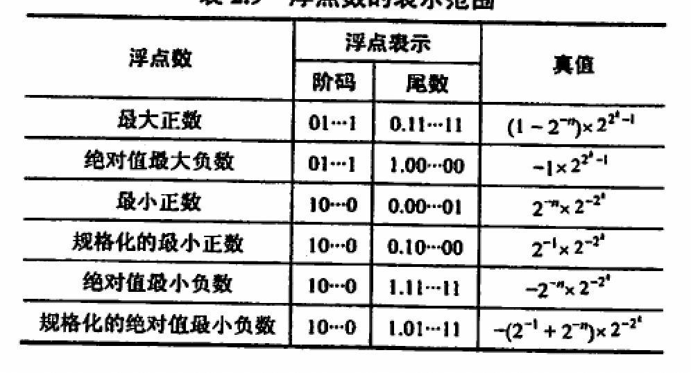

- [[汉字的表示和编码]]
- [[定点数的表示]]
- [[移位运算]]
- 定点数
	- [[定点加减计算]]
		- [[溢出判断]]
	- [[定点乘法运算]]
	- [[定点除法运算]]
- 浮点数
	- [[规格化浮点数]]
	- [[IEEE754]]
	- 溢出：规格化之后发生了溢出才能算作溢出
	- {:height 217, :width 407}
- [[ALU设计]]