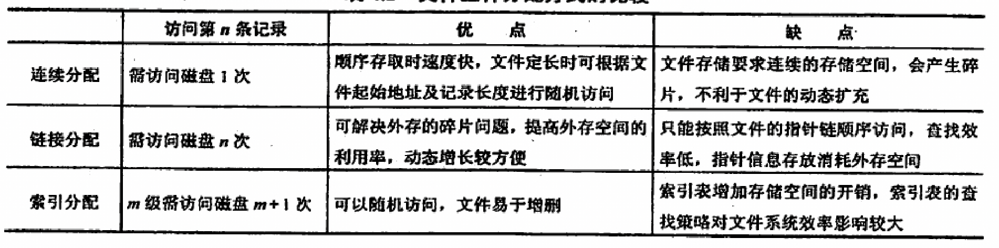

- {:height 462, :width 348}
- 目录实现
	- 哈希表
	- 线性表
- 文件分配方式
	- 连续分配
	- 链接分配
		- 隐式链接
			- 每一块自带一个指向下一块的链接
		- 显式链接
			- 单独有一个文件分配表记录信息
			- FAT
	- 索引分配
		- 每一个文件使用一个索引块指示
		- 索引表用于通过文件名查询索引块
		- 处理大文件的方案
			- 链接方式
				- 将多个索引块链接在一起
			- 多层索引
			- 混合索引
	- 
- 空闲空间管理
	- 空闲表法
		- 采用一个表保存空闲区的第一个盘块号和盘块数量
	- 空闲链表法
		- 将所有空闲的盘块链接成一个链
		- 分配的时候从链首连续取出一定数量的盘块
		- 回收的盘块放到末尾
	- 位示图法
		- 每一个盘块对应位示图中的一位
		- 1代表占用，0代表未占用
		- 计算公式$b = n(i - 1) + j$
		  其中n是每一行的位数
		- 恢复用计算公式
		  $$i = (b - 1)\div n+1 \\ j = (b - 1)\ \mathrm{MOD}\ n + 1$$
	- 成组链接法
		- 每n个空闲的