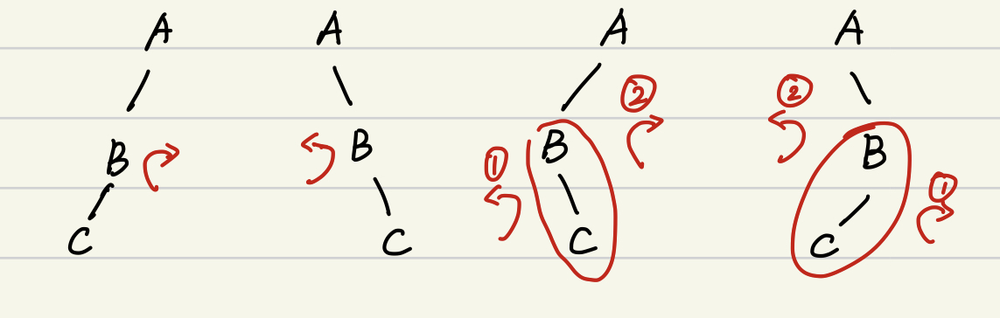

- [[二叉树]]
- 树的存储方式
	- 存储每个节点的父节点
		- 常用于并查集
	- 使用邻接表存储所有的子节点
	- 使用 [[二叉树]]存储
		- 左儿子挂接最左侧的孩子
		- 右儿子挂接兄弟节点
- 排序二叉树
  id:: 6135d0fc-2457-4e54-9034-6d56c13ec261
	- 中序遍历有序
	- 删除操作
		- 当某个将要被删除的节点同时拥有左右子树的时候，将它左子树中最大的节点移动到将要被删除的节点的位置即可
- AVL
	- 要素
		- 是 ((6135d0fc-2457-4e54-9034-6d56c13ec261))
		- 对于任何节点其左子树和右子树高度差不大于1
	- 平衡因子$h_{left} - h_{right}$
	- 几种处理方式
		- {:height 130, :width 424}