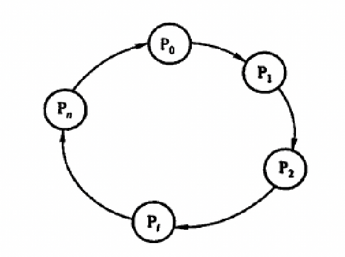
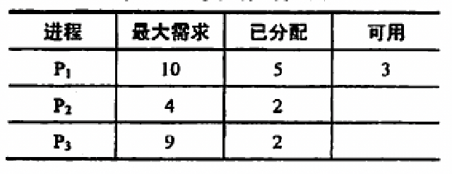

- **必要**条件
	- 互斥条件
		- 对资源排他性控制
	- 不剥夺条件
	  id:: 612b4d00-6aaf-4990-bda1-fbbf1a40055f
		- 资源在被使用完前不会被其他进程强行夺走
	- 请求保持条件
	  id:: 612b4d21-7e39-4a39-9d47-665a13de27f6
		- 进程在占有至少一个资源的情况下请求更多的资源
	- 循环等待条件
	  id:: 612b4d3c-cda5-49e2-a8bb-04bd2eca2298
		- 存在一个资源请求的环
		  {:height 255, :width 308}
- 处理方法
	- 死锁预防
		- 设置条件破坏四个必要条件其中的一个或几个
		- ((612b4d00-6aaf-4990-bda1-fbbf1a40055f)) ：当申请的资源得不到满足的时候必须释放已经占有的所有资源
		- ((612b4d21-7e39-4a39-9d47-665a13de27f6)) ：一次性必须申请所有需要的资源
		- ((612b4d3c-cda5-49e2-a8bb-04bd2eca2298)) ：必须按照一定的顺序申请资源
	- 避免死锁
		- 防止系统进入不安全状态
		- 安全状态
			- 如果可以找到一个序列使得按照该序列分配资源可以满足所有进程的需求则称为安全状态。
			-
			  > 例如
			  > {:height 117, :width 301} 
			  > 可以按照序列$P_2 \to P_1 \to P_3$分配
		- 银行家算法
			- 三个矩阵
				- $Max$，每行一个进程，每列一类资源，标识进程申请的最大资源数量
				- $Allocation$，每行一个进程，每列一类资源，标识进程当前已经拥有的资源数量
				- $Need$，计算方式$Max - Allocation = Need$，标识还需要的资源数量
			- 一个向量
				- $Avaliable$，一行，每列一类资源，标识当前各个资源的剩余
			- 通过上面的方法搜索一个序列使其可以被正常分配，若找到了则是**安全状态**，可以进行分配