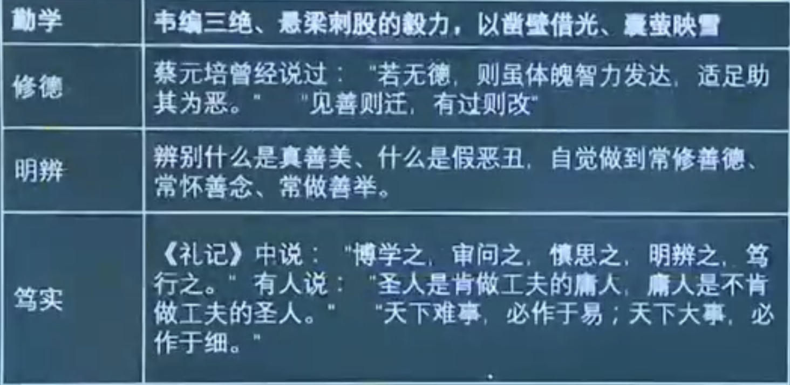

- 涉及
	- 国家：富强、民主、文明、和谐
	- 社会：自由、平等、公正、法制
	- 公民：爱国、敬业、诚信、友善
	  id:: 293014de-d5fe-4d9c-9533-318a0fcd1111
- 建设什么样的国家
- 建设什么样的社会
- 培育什么样的公民
- 历史底蕴
	- 中华优秀传统文化是核心价值观的**重要源泉**，是中华民族的精神命脉
	- 培育和弘扬核心价值观必须立足于中华优秀传统文化
- 现实基础
	- 中国特色社会主义建设实践
		- 是价值观的时间根据
		- 建设的成功经验是对价值观的检验
- 道义力量
	- 先进性
		- 最先进社会制度的本质规定在价值层面的**集中反映**
	- 人民性
		- 代表广大人民的**价值诉求**
	- 真实性
		- 知行合一
- 做社会主义核心价值观的积极践行者
	- 扣好人生的第一粒扣子
	- 勤学、修德、明辨、笃实
	  > 考法：使用名言引出以上内容 
	  {:height 320, :width 626}