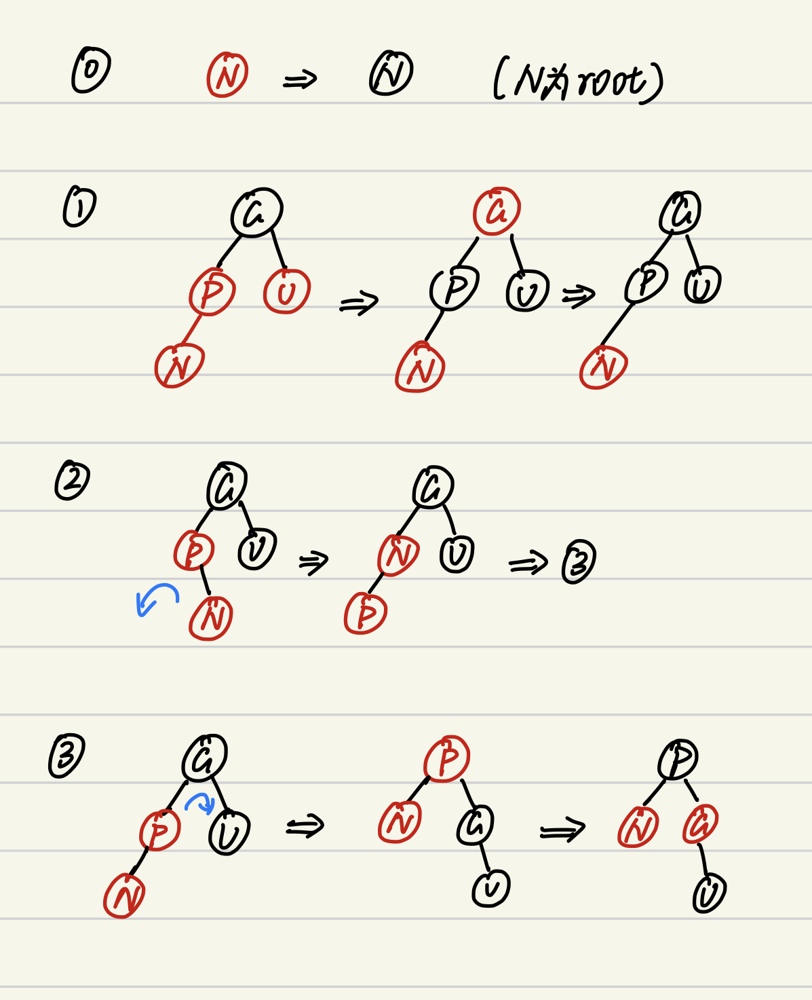

- 属于自平衡二叉树
- 性质
	- 所有节点均使用红色和黑色标记
	- 所有的叶子结点均为黑色
	  > 注意这里的叶子结点指树中的NIL
	- 所有的**红色**节点的儿子必定为**黑色**
	- 根节点必定为**黑色**
	- 对于任何一个节点到达以其为`root`的子树的所有叶子结点（即NIL）的**简单路径**所经过的黑色节点数量相等
- 几个概念
	- `bh`：即黑色高度，指的是当前路径中单个路径中黑色节点最大的数量
		- 对于任何一个节点$x$，以其为根的字数的内部节点数量至少为$2^{bh(x)} - 1$
	- $h \geq 2\log_2(n + 1)$
	- 内部节点
		- 除了叶子结点（即NIL）其余全为内部节点
- 操作
	- 插入
		- 新插入的节点统一为**红色**
		- 几个概念
			- 此处我们认为待插入的节点为$N$
			- 待插入节点的父亲节点为$P$，父亲节点的兄弟节点为$U$，父亲节点的父亲节点为$G$
		- 冲突处理
			- {:height 624, :width 310}
			- 一些需要注意的点
				- 对于情况2和3，