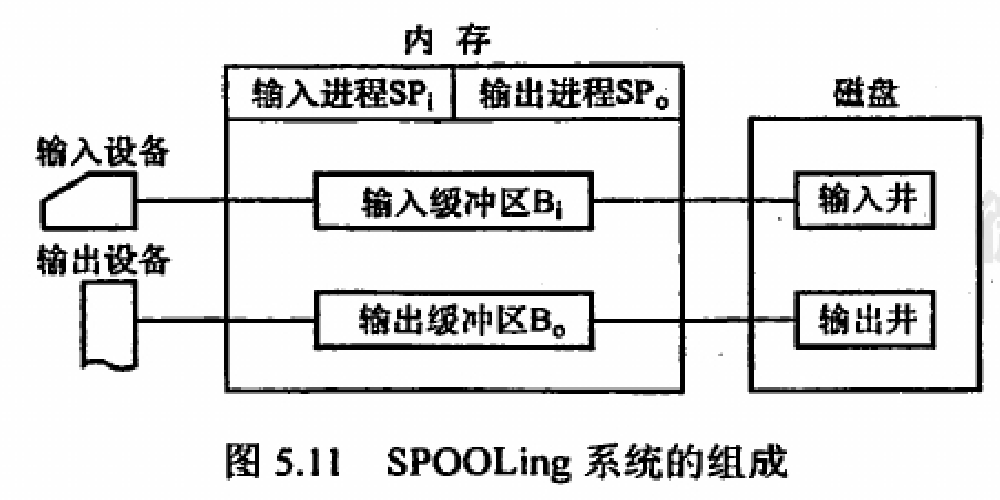

- 三种使用方式
	- 独占使用
	- 分时共享
	- SPOOLing技术（虚拟）
- 四个数据结构
	- DCT 设备控制表
	- COCT 控制器控制表
	- CHCT 通道控制表
	- SDT 系统控制表
- 设备分配
	- 分配策略
		- 设备特性
		- 用户要求
		- 系统配置
	- 分配方式
		- 动态分配
			- 针对共享方式
		- 静态分配
			- 针对独占使用方式
- LUT 逻辑设备表
	- 通过逻辑设备表保存逻辑设备到物理设备到映射关系
- SPOOLing技术
	- 缓和CPU到高速和IO的低速的问题
	- {:height 219, :width 512}
	- 井
		- 用于收容设备IO所需的数据
	- 缓冲区
		- 输入缓冲区暂存**从设备到输入井**的数据
		- 输出缓冲区暂存**从输出井到设备**的数据
	- 输入/输出进程
		- 作为IO操作的外围控制机，自主管理输入/输出井的数据进出
		- ==注意SPOOLing技术**不需要**外围计算机支持==
	- 基本组成
		- 预输入程序
		- 井管理程序
		- 缓输出程序